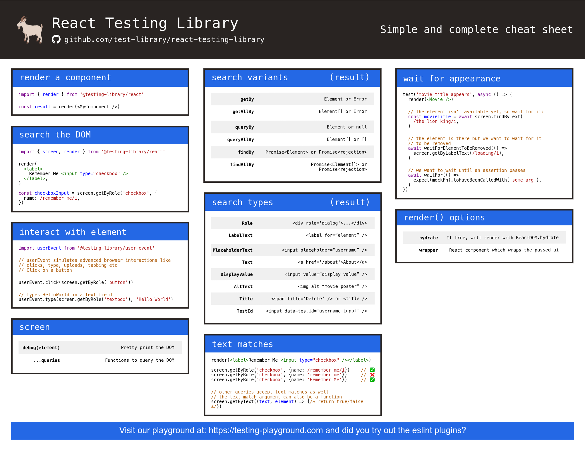

# Project 1: Fetch Data and Display

This project was implemented to be hands on with Storybook for component testing and playwright for e2e testing.

## Tech Stack

- NextJS 14(app router) for SSR such that authentication key to fetch api will not be exposed client side
- dabbled around environment variables and how they are handled in next.js
- typescript for type safety
- zod for run time schema validation (search input(can only be a number) and response api validated)
- tailwind for styling
- storybook for component testing
- e2e using playwright

# To Run this Locally

Clone this repository
`git clone`
Go to the project directory
`cd sireto/project1`
Install the necessary packages
`npm install`
The dev environment should open at localhost:3000
To kill the process running at port 3000

```
lsof -i:3000
kill -9 [PID]
```

Run it locally
`npm run dev`
To run storybook
`npm run storybook`
To run playwright
`npx playwright test --debug`

# REFERENCES:

## Storybook

- [Storybook official github](https://github.com/storybookjs/storybook/blob/next/test-storybooks/external-docs/components/AccountForm.stories.tsx)
- [Tailwind classes not working in storybook ](https://dev.to/lico/nextjs-using-tailwind-with-storybook-5aie)
- [Integrating Next.js and Storybook to use next routing,image optimization in storybook itself](https://storybook.js.org/blog/integrate-nextjs-and-storybook-automatically/)
- [Storybook for Next.js](https://storybook.js.org/docs/8.0/get-started/nextjs)
- [Interaction tests in storybook](https://storybook.js.org/docs/writing-tests/interaction-testing)

## React Testing Library



## Playwright for e2e testing - Handy References

Go through it serially

- [Playwright brief](https://ray.run/blog/mastering-playwright-test-automation-your-comprehensive-cheat-sheet#seeking-out-page-elements)

- [Playwright Best Practises](https://playwright.dev/docs/best-practices)

- [Playwright all use cases example github](https://github.com/MarcusFelling/demo.playwright/blob/main/basic/2-actions.spec.ts)

- Testing -> Arrange(page.goTo),Act(locators) and Assert(expect)

- Selecting and finding elements (act)

  - [Locators](https://playwright.dev/docs/locators) and [filtering locators](https://playwright.dev/docs/locators#filtering-locators)
  - [Other Locators](https://playwright.dev/docs/other-locators)

- [Test assertions](https://playwright.dev/docs/test-assertions)

- Testing input elements

  - [Github example](https://github.com/MarcusFelling/demo.playwright/blob/main/basic/2-actions.spec.ts)
  - [Actions docs](https://playwright.dev/docs/input)

- [Navigations](https://playwright.dev/docs/navigations)

- API

  - [API Testing playwright official doc](https://playwright.dev/docs/api-testing) and [Blog post link](https://anandhik.medium.com/api-testing-in-playwright-a4d031ba427c)
  - [Mocking API](https://playwright.dev/docs/mock)
  - [Mock browser APIs](https://playwright.dev/docs/mock-browser-apis)
  - [Network - avoiding testing third party dependencies and guaranteeing the response needed](https://playwright.dev/docs/network)

  ### Github Repos

  Best ones in order

  - [official plawright example github repo](https://github.com/microsoft/playwright/tree/main/examples)
  - [playwright-template](https://github.com/abhaybharti/playwright-framework-template/tree/master/src/tests)
  - [How to write tests](https://github.com/LambdaTest/playwright-sample/blob/main/playwright-test-ts/tests/download.spec.ts)
  - [demo.playwright - MarcusFelling](https://github.com/MarcusFelling/demo.playwright)
  - [testing example repo for cypress,playwright,jest...](https://github.com/testomatio) and [for playwright example](https://github.com/testomatio/examples/tree/master/playwright)
  - [Material-UI using playwright for e2e](https://github.com/mui/material-ui/tree/master/test)
  - [sample-examples](https://github.com/akshayp7/playwright-typescript-playwright-test/tree/main/tests)
